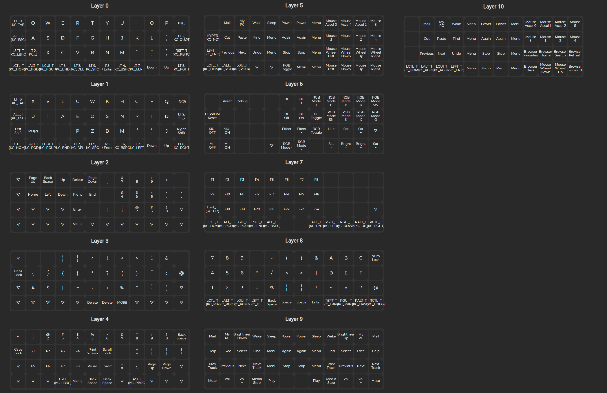

# Franken-Planck

Franken-Planck is my evolving 14 layer custom keymap for a 47 key Rev 6. Planck Keyboard. 
Ideas from others were assimilated in Borg like fashion. Resistance is futile, I am a Cyclon |)

The Francken-Planck Layout firmware was created with the online [QMK Configurator](https://config.qmk.fm).
It is just a JSON file that can be turned into C code and baked into firmware. Either using QMK's online tooling or locally  with the [QMK CLI tools](https://docs.qmk.fm/#/cli).

My workflow is as follows:

1. Upload the francken-planck.json to the above mentioned site
2. Adjust the layout to changed I consider to be a good idea.
3. Download the JSON of the changed keymap
4. Create a PDF to use as a cheat cheat.
5. Change the JSON into a _keymap.c_ C code file using the qmk command line tooling.
6. Copy the C code into my keymap in the qmk source tree
7. Build the firmware using _qmk compile_
8. Flash the firmware to my keyboard using _qmk flash_
9. Commit made changes to this repository

## Own ideas

Ideas I considered to be my own, or which I could not recall where I had seen it before, but I am sure I assimilated and twisted them.

_Please if you think I got it from you or anybody else, let me know and I will add it to the list of assimilated ideas_

* My media key layer which is accessible by holding space. Media keys such as volume up and mute and the media player. A complete set of keys can be accessed with either the left or right hand.
* Both a left and right hand mouse layer.
* Both a left and right hand num pad
* A layer with all 24 Function keys.
* A layer with all the Asian language related keys, I want to sort out whether I can use these as application lauchers from [AutoHotkey](https://www.autohotkey.com/)
* Tapping raise is enter and Tapping lower is backspace so they can be used with the thumbs
* Moving shift keys next to raise/lower so that they can be used with the thumbs like in some split layout such as the [Kyria](https://blog.splitkb.com/blog/introducing-the-kyria)
* Tapping the left modifier keys for big arrow movements, Home, Page-Down, Page-Up, End.
* Holding the the raise or lower gives me repeatable arrow keys and also a caps lock under escape, if I might ever need that.
* I swapped tilde and backtick from lower and raise. I tend to use tilde more, since that is a home directory in Linux.

## Initial Assimilated ideas

* Vim layer [MacinPlanck](https://macintacos.github.io/macinplanck-configuration). I am still looking into this, since this is MAC specific, and I am using Windows and Linux.
* Making arrow keys available [Noah Fredricl's Planck](https://noahfrederick.com/log/the-planck-keyboard)
  _Sadly this custom layout with some extra coding for macros does not work for a Rev6_ I think I got close with using just the JSON file.
* Raise space does backspace and  Lower space does delete. _Not sure who I stole that one from_

## Move to Neo2 (experimental)

As a programmer I type a lot of parens and other symbols. Although I modified the default layout a bit to make typing matching parens easy to do and easy to remember, it still makes my hands hurt. I still consider to move to a 40% split keyboard like a Corne. This would be better for my back and shoulders. However Corne has 42 keys where a Planck has 48. Can I do that with layers and how?

Then I discovered [Neo2](https://neo-layout.org) in a video by [Jan Lunge](https://www.youtube.com/watch?v=rhdMVXlnQIM), an alternative keyboard layout optimized for the German language and programming and mathematics.
It is said to work well for English too. Dutch is close enough to German so that that would work well too. It has special layers for programming and mathematics. However, moving away from the known QUERTY, QUERTZ or AZERTY layout might be challenging.

On Android NEO2 is available as a keyboard Layout under the German language. I gave it a try. Although it was still a bit of hunt and peck, it still felt more comfortable and faster than QUERTY and certainly something I wanted learn.

## My NEO2 adaptation

Jan  kindly shared his [Planck layout](https://blog.heaper.de/planck-neo2-config/). I converted his `keymap.c` to JSON using the QMK toolkit. I uploaded this to the QMK configurator and started to copy his NEO2 adaptation for the Planck into my own config.
At the moment I do not have the macro layout for German umlauts implemented yet. As a Dutch native I do use them less often. Since I am probably using a later firmware than Jan I am a bit hesitant to copy his code. I am also considering to use the Unicode support of QMK. I am aware that this can be a hit miss cross platform.

* The NEO2 layer 0 is on layer 1 in my _Franken-PLanck_ layout.
  You can swith to it from QUERTY layout by pressing the top right key(typically backspace). 
  You can go back to QUERTY by pressing the same key again.
* I changed my modified layer 3 to Jan's NEO2 layout for parens and other symbols used by programmers. 
* I added Jan's arrow and numberpad layout on layer 2. Layer 2 is reachable by holing the righ edge key of the second row from above or the second key from the left on the second row from the bottom. This allows for easy access of the number keys or arrows with the other hand. _I am not sure whether I keep this as is or whether I will use my left numpad & hexpad from layer 8 and make a more vi like movement cluster._

I did not use any other Layer by Jan because I prefer my own richer layers for mouse, media and more.

I am still studying the official NEO2 documentation. I do speak German, I learned programming from der 64'er and grew  up with German TV. I worked in Germany.
Still reading technical German documentation it is not something I read everyday nowadays. So it is something to get into again. 

## Learning to type

Although I am not a really slow typer, I am not certified and typing with all 10 fingers and always using the correct hand for some keys. This is certainly something to learn too.

## Moving away from the Planck

Although I am still considering a Corne or something with slightly more keys that is a bit on ice because of the 2021 chip shortage. I simply cannot obtain the desired Microcontrollers.
Since I do not plan on soldering it myself having a shop do this for me is also challenging. All known shops in the Netherlands, UK, US or Hongkong currently do not offer soldering services.(May 2021).
This gives me some time to move to the NEO2 layout, become a better typist and consider my options. How many keys?

## keymap layers

